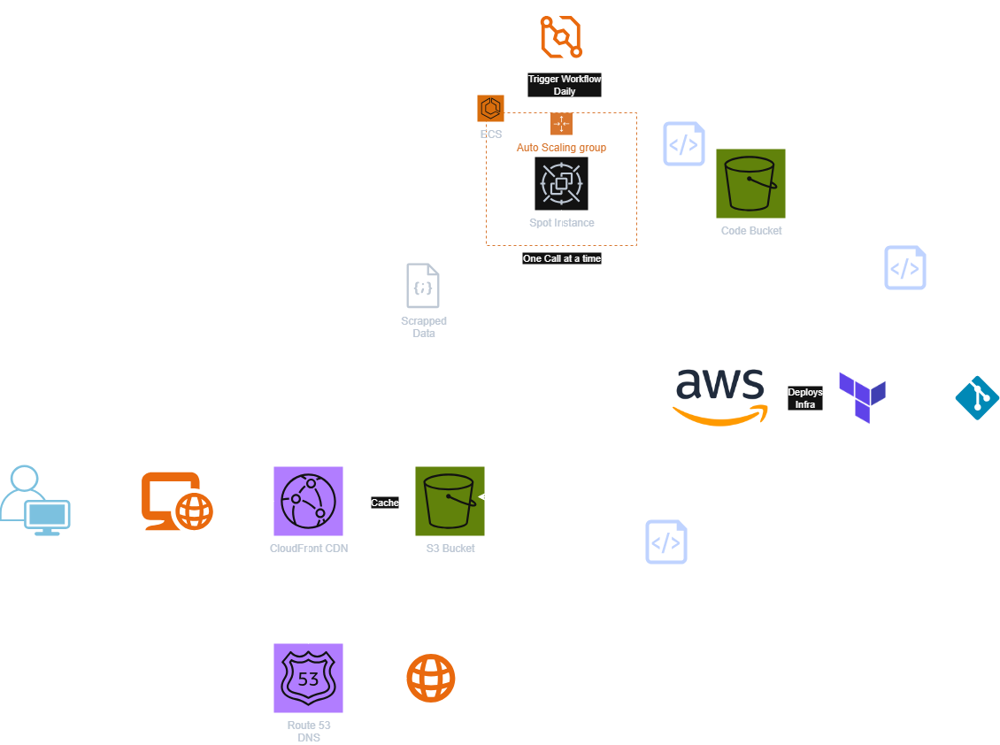

# Interesting Chess

A comprehensive web application that analyzes Chess.com titled players to identify statistically interesting consecutive win streaks. The platform combines a Python data scraper, AWS cloud infrastructure, and a React frontend to track unlikely performance patterns in professional chess.

## Features

- **Data Pipeline**: Automated Chess.com data scraping using the [`chess.com` Python module](https://github.com/sarartur/chess.com)
- **Statistical Analysis**: Glicko/Elo rating-based probability calculations for streak analysis
- **Cloud Infrastructure**: AWS-based deployment with ECS, S3, CloudFront, and EventBridge
- **Modern Frontend**: React TypeScript SPA with Chess.com-inspired design
- **Real-time Updates**: Automated daily data collection and processing
- **Multiple Deployment Options**: Static hosting, AWS infrastructure, or local development

## Overview

Interesting Chess is a full-stack web application that tracks statistically unlikely win streaks by titled chess players. The system consists of three main components:

1. **Data Scraper**: Python application that fetches Chess.com player data and analyzes game sequences
2. **Cloud Infrastructure**: AWS-based deployment pipeline with automated scheduling and data storage
3. **Frontend Application**: React TypeScript SPA for visualizing and exploring streak data

The application analyzes Chess.com data to identify consecutive wins with extremely low probability thresholds (≤5%, ≤1%, ≤0.1%, ≤0.01%), highlighting interesting performance patterns. The platform presents this data through an intuitive interface that mimics Chess.com's visual style, providing chess enthusiasts, coaches, and fair-play teams with a tool for identifying remarkable or questionable streaks.

### Key Capabilities

- **Time Control Analysis**: Focuses on specific time controls (3+0, 10+0, 1+0, 5+0, 3+1, 3+2)
- **Rating-Based Probability**: Uses Glicko rating system with RD when available, falls back to Elo
- **Automated Processing**: Daily scheduled runs with progress tracking and ETA calculations
- **AWS Integration**: S3 storage, CloudFront distribution, and ECS container execution
- **Static Deployment**: Frontend can be deployed to any static hosting service

## Architecture

The application follows a three-tier architecture with automated data processing:



### Complete System Architecture

**Data Layer (Python + AWS)**:

- **Data Scraper**: Python application using the official Chess.com API
- **ECS Cluster**: Containerized execution environment with Auto Scaling Groups
- **EventBridge**: Scheduled daily execution (configurable via cron expressions)
- **S3 Storage**: Separate buckets for code artifacts and processed data
- **CloudWatch**: Comprehensive logging and monitoring

**Distribution Layer (AWS CDN)**:

- **CloudFront**: Global CDN with custom domain support
- **Origin Access Control**: Secure S3 access without public bucket exposure
- **Cache Optimization**: Configurable caching policies for performance

**Presentation Layer (React SPA)**:

- **Static Frontend**: Deployable to any static hosting service
- **Client-side Processing**: All data transformation happens in the browser
- **TypeScript**: Full type safety across the application

## Project Structure

```bash
ChessCoach/
├── README.md                           # This file
├── architecture.png                    # Architecture diagram
├── package.json                        # Frontend dependencies
├── vite.config.ts                      # Build configuration
├── tailwind.config.ts                  # Styling configuration
├── tsconfig.json                       # TypeScript configuration
├── 
├── client/                             # React frontend application
│   ├── index.html                     # HTML entry point
│   ├── public/                        # Static assets
│   │   ├── favicon.ico               
│   │   └── data/results.json         # Sample data for development
│   └── src/                          # Source code
│       ├── App.tsx                   # Main application component
│       ├── main.tsx                  # Application entry point
│       ├── components/               # React components
│       ├── hooks/                    # Custom React hooks
│       ├── lib/                      # Utilities and services
│       └── pages/                    # Page components
│
├── server/                            # Backend API (currently minimal)
│   └── index.ts                      # Server entry point
│
├── shared/                           # Shared type definitions
│   └── schema.ts                     # Zod validation schemas
│
├── data_layer/                       # Data processing infrastructure
│   ├── scraping/                     # Python data scraper
│   │   ├── main.py                   # Main scraper application
│   │   ├── chess_api.py              # Chess.com API client
│   │   ├── config.py                 # Configuration constants
│   │   ├── models.py                 # Data models
│   │   ├── probability.py            # Statistical calculations
│   │   ├── streak_analyzer.py        # Core analysis logic
│   │   ├── player_games_by_basetime_increment.py
│   │   ├── http_client.py            # HTTP utilities
│   │   ├── requirements.txt          # Python dependencies
│   │   └── README.md                 # Scraper documentation
│   │
│   └── terraform/                    # AWS infrastructure
│       ├── main.tf                   # Main Terraform configuration
│       ├── variables.tf              # Input variables
│       ├── outputs.tf                # Output values
│       ├── cloudfront.tf             # CDN configuration
│       ├── ecs.tf                    # Container orchestration
│       ├── s3.tf                     # Storage configuration
│       ├── iam.tf                    # Permissions and roles
│       ├── vpc.tf                    # Network configuration
│       ├── eventbridge.tf            # Scheduling configuration
│       ├── terraform.tfvars.example  # Configuration template
│       └── README.md                 # Infrastructure documentation
│
└── backup/                           # Historical data backups
    └── *.json                        # Previous analysis results
```

### Frontend Architecture

The application is built as a static React SPA using TypeScript:

- **Framework**: React 18 with TypeScript for type safety
- **Build Tool**: Vite for fast development and optimized production builds
- **Routing**: Wouter for lightweight client-side routing
- **State Management**: Direct data imports and React state (no external state management)
- **UI Framework**: Radix UI components with shadcn/ui styling system
- **Styling**: Tailwind CSS with CSS variables for theming, designed to emulate Chess.com's visual style
- **Data Processing**: Client-side data service that processes JSON data locally

### Static Architecture

The application is fully static with no backend dependencies:

- **Data Source**: Static JSON file imported directly into the application
- **Processing**: All data transformation and analysis happens in the browser
- **Deployment**: Can be hosted on any static hosting service (GitHub Pages, Netlify, Vercel, etc.)
- **Performance**: Faster loading with no API round trips, everything cached by CDN

## Data Access & API

### Output Format

The scraper generates a comprehensive `results.json` file with four main sections:

```json
{
  "summary": {
    "window_days": 30,
    "players_processed": 1250,
    "games_processed": 45203,
    "streaks_found": 42,
    "counts_by_threshold": {
      "≤5%": 15,
      "≤1%": 8,
      "≤0.1%": 3,
      "≤0.01%": 1
    },
    "generated_at": 1693612800
  },
  "players": {
    "username": {
      "username": "chess_player",
      "title": "GM",
      "avatar": "https://images.chesscomfiles.com/...",
      "max_rating": 2750,
      "country": "US"
    }
  },
  "interesting_streaks": [
    {
      "username": "chess_player",
      "player_title": "GM",
      "player_max_rating": 2750,
      "streak": {
        "length": 8,
        "prob": 0.0023,
        "threshold": "≤0.1%",
        "start_time": 1693440000,
        "end_time": 1693526400,
        "games": [...]
      }
    }
  ],
  "time_controls_count": {
    "180": 15420,
    "600": 12850,
    "60": 8930
  }
}
```

### Data Access Methods

- **Direct S3 Access**: `s3://bucket-name/latest/results.json`
- **CloudFront CDN**: `https://cdn-domain/latest/results.json`
- **Local Development**: `client/public/data/results.json`
- **Custom Domain**: `https://yourdomain.com/latest/results.json`

## Development

## Installation & Setup

### Prerequisites

- Node.js (v18 or later)
- Python 3.8+ with pip
- AWS CLI (for infrastructure deployment)
- Terraform (>= 1.5.0) (for infrastructure deployment)

### Quick Start (Frontend Only)

1. **Clone the repository:**

   ```bash
   git clone <repository-url>
   cd ChessCoach
   ```

2. **Install frontend dependencies:**

   ```bash
   npm install
   ```

3. **Start development server:**

   ```bash
   npm run dev
   ```

### Full Stack Setup

#### 1. Frontend Setup

```bash
# Install dependencies
npm install

# Start development server
npm run dev

# Build for production
npm run build
```

#### 2. Data Scraper Setup

```bash
cd data_layer/scraping

# Create virtual environment
python -m venv venv
source venv/bin/activate  # Linux/Mac
# or
venv\Scripts\activate     # Windows

# Install dependencies
pip install -r requirements.txt

# Set environment variables
export APP_NAME="interesting-chess"
export VERSION="1.0"
export USERNAME="your_username"
export EMAIL="you@example.com"

# Run scraper
python main.py --days 7 --limit-players 50
```

#### 3. AWS Infrastructure Setup

```bash
cd data_layer/terraform

# Copy configuration template
cp terraform.tfvars.example terraform.tfvars

# Edit terraform.tfvars with your settings
# Set AWS credentials
export AWS_PROFILE=your-profile
# or
export AWS_ACCESS_KEY_ID=your-key
export AWS_SECRET_ACCESS_KEY=your-secret

# Deploy infrastructure
terraform init
terraform plan
terraform apply
```

### Development Workflow

- **Development Server**: Vite development server with hot module replacement
- **Type Safety**: Shared schema definitions using Zod validation
- **Path Aliases**: Configured for clean imports (`@/` for client, `@shared/` for shared code)
- **Build Process**: `vite build` generates optimized static files ready for deployment

### Probability Calculation System

The application implements sophisticated rating-based probability calculations:

#### Glicko System (Preferred)

When rating deviation (RD) is available:

- Converts ratings to μ-scale: `μ = (R - 1500) / 173.7178`
- Converts RD to φ-scale: `φ = RD / 173.7178`
- Calculates uncertainty factor: `g(φ) = 1 / √(1 + 3φ²/π²)`
- Expected win probability: `E = 1 / (1 + exp(-g(φ_opp) × (μ_winner - μ_loser)))`

#### Elo System (Fallback)

When RD is unavailable:

- Classic Elo expectation: `E = 1 / (1 + 10^(-(R_winner - R_loser)/400))`

#### Streak Analysis

- Combined probability = product of individual game probabilities
- Uses log-space arithmetic to prevent numerical underflow
- Tier classification system (≤0.01%, ≤0.1%, ≤1%, ≤5%) based on probability thresholds

## Monitoring & Troubleshooting

### Data Pipeline Monitoring

#### ECS Task Monitoring

```bash
# Check ECS cluster status
aws ecs describe-clusters --clusters interesting-chess-cluster

# View task logs
aws logs get-log-events --log-group-name /ecs/interesting-chess-scraper

# Check Auto Scaling Group
aws autoscaling describe-auto-scaling-groups --auto-scaling-group-names interesting-chess-asg
```

#### S3 Data Verification

```bash
# Check latest results
aws s3 ls s3://your-bucket/latest/ --recursive

# Download results for inspection
aws s3 cp s3://your-bucket/latest/results.json ./
```

### Common Issues

#### Data Scraper Issues

1. **Rate Limiting (429 errors)**:
   - The chess.com module handles this automatically with exponential backoff
   - Verify you're not running multiple instances

2. **Memory usage for large datasets**:
   - Use `--limit-players` for testing
   - Consider shorter time windows initially

3. **S3 Upload failures**:
   - Verify AWS credentials: `aws sts get-caller-identity`
   - Check S3_LOCATION format: `s3://bucket/prefix/`
   - Ensure bucket exists and permissions are correct

#### Infrastructure Issues

1. **ECS tasks fail to start**:
   - Check Auto Scaling Group desired capacity
   - Verify ECS cluster has available capacity
   - Review IAM role permissions

2. **No EC2 instances available**:
   - Check EC2 service limits in your AWS account
   - Verify VPC and security group configuration
   - Review spot instance availability

3. **CloudFront not serving content**:
   - Verify Origin Access Control (OAC) configuration
   - Check S3 bucket policies
   - Invalidate CloudFront cache if needed

### Performance Optimization

- **Cost Optimization**: Uses EC2 spot instances with Auto Scaling
- **Rate Limiting**: Built-in Chess.com API compliance
- **Progress Tracking**: ETA calculations and logging every 10 players
- **Parallel Processing**: Time controls processed efficiently
- **Caching**: CloudFront distribution reduces S3 costs

## Configuration

### Environment Variables

#### Data Scraper Configuration

```bash
# Required for Chess.com API compliance
export APP_NAME="interesting-chess"
export VERSION="1.0"
export USERNAME="your_chesscom_username"
export EMAIL="your_contact_email"

# Optional S3 upload
export S3_LOCATION="s3://your-bucket/path/"
export AWS_REGION="us-east-1"
```

#### Terraform Configuration (terraform.tfvars)

```hcl
project_name = "interesting-chess"
aws_region = "us-east-1"
app_name = "interesting-chess"
app_version = "1.0.0"
username = "your_chesscom_username"
email = "your_contact_email"

# Chess analysis parameters
titles = "GM,WGM,IM,WIM,FM,WFM,NM,WNM,CM,WCM"
days_window = 30
limit_players = 0  # 0 = no limit

# Scheduling (daily at 03:05 UTC)
schedule_expression = "cron(5 3 * * ? *)"

# CloudFront and custom domain (optional)
create_cloudfront = true
acm_certificate_arn = "arn:aws:acm:us-east-1:123456789012:certificate/..."
alternate_domain_names = ["interestingchess.com", "www.interestingchess.com"]
```

### Data Scraper Command Line Options

```bash
python main.py [OPTIONS]

# Options:
--days          Analysis window in days (default: 30)
--out           Output directory (default: ./data)
--titles        Comma-separated chess titles (default: GM,WGM,IM,WIM)
--limit-players Limit number of players for testing
--verbose       Enable detailed logging (default: True)
```

## License

[Add your license information here]

## Contributing

[Add contribution guidelines here]

## Contact

For questions about this application:

- **Technical Issues**: Create an issue in this repository
- **Chess.com API**: See their [official documentation](https://www.chess.com/news/view/published-data-api)
- **AWS Infrastructure**: Refer to the Terraform documentation in `data_layer/terraform/`
- **Data Analysis**: See the scraper documentation in `data_layer/scraping/`
